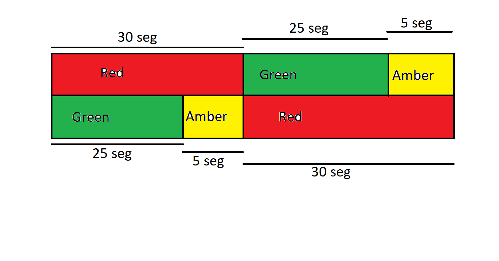

\tableofcontents

# Practica \# 1: Semáforo.
En esta practica se programara la secuencia de un semáforo con funciones
avanzadas de programación.

# Mapa de secuencia:

# Distribución de salidas.
 

# Archivo de secuencia \#B3:0

| Posición | 15 | 14 | 13 | 12 | 11 | 10 | 9 | 8 | 7 | 6 | 5 | 4 | 3 | 2 | 1 | 0 |
|----------|----|----|----|----|----|----| - | - | - | - | - | - | - | - | - | - |
| B3:0     | 0  | 0  | 0  | 0  | 0  | 0  | 0 | 0 | 0 | 0 | 0 | 0 | 0 | 0 | 0 | 0 |
| B3:1     | 0  | 0  | 0  | 0  | 0  | 0  | 0 | 0 | 0 | 1 | 0 | 0 | 0 | 0 | 0 | 1 |
| B3:2     | 0  | 0  | 0  | 0  | 0  | 0  | 0 | 0 | 0 | 0 | 1 | 0 | 0 | 0 | 0 | 1 |
| B3:3     | 0  | 0  | 0  | 0  | 0  | 0  | 0 | 0 | 0 | 0 | 0 | 1 | 0 | 1 | 0 | 0 |
| B3:4     | 0  | 0  | 0  | 0  | 0  | 0  | 0 | 0 | 0 | 0 | 0 | 1 | 0 | 0 | 1 | 0 |

| mask | 0 | 0 | 0 | 0 | 0 | 0 | 0 | 0 | 1 | 1 | 1 | 1 | 1 | 1 | 1 | 1 |
|------| - | - | - | - | - | - | - | - | - | - | - | - | - | - | - | - |

En decimal el valor de la mascara es ***ff*** 

# Secuencia de semáforo.

Con la funcion de secuenciador podremos habilitar o deshabilitar bits a medida
que se crea necesario dependiendo del uso y logica que se le este dando al 
programa.

| Paso | Semáforo 1 | Semáforo 2 | salidas       |
|------|------------|------------|---------------|
| 1    | rojo       | verde      | O:0/0 y O:0/6 |
| 2    | rojo       | ambar      | O:0/0 y O:0/5 |
| 3    | verde      | rojo       | O:0/2 y O:0/4 |
| 4    | ambar      | rojo       | O:0/1 y O:0/4 |

